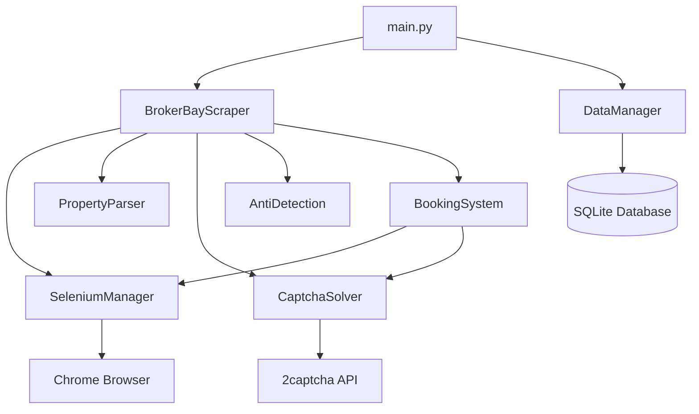

# 🏠 Broker Bay Property Scraper & Booking System

[](https://python.org)
[](LICENSE)
[]()

An advanced, autonomous web scraping system designed specifically for accessing the Broker Bay website to search for Canadian properties and automate property viewing bookings. This system incorporates sophisticated anti-detection mechanisms, captcha solving, and comprehensive data management.

## 🌟 Key Features

### 🔍 **Intelligent Property Search**
- **Canadian Address Parsing**: Automatically parses Canadian addresses with postal codes
- **Fuzzy Matching**: Finds properties even with slight address variations
- **Multi-format Support**: Handles various Canadian address formats
- **Real-time Results**: Live property data extraction

### 📅 **7-Day Viewing Schedule**
- **Automated Schedule Generation**: Creates comprehensive 7-day viewing schedules
- **Time Slot Management**: Handles available/unavailable time slots
- **Flexible Booking**: Supports various time formats and preferences
- **Calendar Integration**: Easy integration with external calendar systems

### 🎯 **Automated Booking System**
- **One-Click Booking**: Automated property viewing booking
- **Form Auto-filling**: Intelligent form completion
- **Contact Management**: Stores and manages contact information
- **Booking Verification**: Confirms successful bookings

### 🛡️ **Advanced Anti-Detection**
- **Undetected Chrome Driver**: Bypasses common detection mechanisms
- **User Agent Rotation**: Random user agents from a curated pool
- **Proxy Support**: Rotating proxy servers for IP diversity
- **Random Delays**: Variable delays between requests (2-5 seconds)
- **Header Randomization**: Dynamic HTTP headers
- **Session Management**: Proper session handling and cleanup

### 🤖 **Captcha Solving**
- **2captcha Integration**: Automatic solving of reCAPTCHA v2 and hCaptcha
- **Image Captcha Support**: Basic image-based captcha solving
- **Fallback Handling**: Graceful degradation when solving fails
- **Cost Optimization**: Efficient captcha solving with retry logic

### 💾 **Comprehensive Data Management**
- **SQLite Database**: Robust data persistence
- **Search History**: Complete audit trail of all searches
- **Export Functionality**: CSV export for data analysis
- **Data Integrity**: Transaction-safe database operations

## 🚀 Quick Start

### Prerequisites

- **Python 3.8+** (recommended: Python 3.9+)
- **Chrome/Chromium Browser** (latest version)
- **2captcha API Key** (for captcha solving)
- **Virtual Environment** (already set up as 'scrapper')

### Installation

#### Option 1: Automated Setup (Recommended)

```bash
# Clone the repository
git clone <repository-url>
cd potential-guacamole

# Activate virtual environment
source scrapper/bin/activate

# Run automated setup
python3 setup.py
```

#### Option 2: Manual Setup

```bash
# Activate virtual environment
source scrapper/bin/activate

# Install dependencies
pip install -r requirements.txt

# Create environment file
cp env_example.txt .env

# Edit configuration
nano .env
```

#### Option 3: Shell Script Setup

```bash
# Make executable and run
chmod +x install.sh
./install.sh
```

### Configuration

1. **Edit `.env` file:**
```env
# Required: 2captcha API key
CAPTCHA_API_KEY=your_2captcha_api_key_here

# Optional: Proxy settings
PROXY_LIST=proxy1:port,proxy2:port,proxy3:port

# Rate limiting (seconds)
MIN_DELAY=2
MAX_DELAY=5
REQUEST_TIMEOUT=30

# Database
DATABASE_URL=sqlite:///broker_bay_scraper.db

# Logging
LOG_LEVEL=INFO
```

2. **Get 2captcha API Key:**
   - Visit [2captcha.com](https://2captcha.com)
   - Create account and add funds
   - Copy API key to `.env` file

## 📖 Usage

### Command Line Interface

#### Search Properties
```bash
# Basic search
python3 main.py search "123 Main Street, Toronto, ON M5V 3A8"

# Search with debug logging
python3 main.py --log-level DEBUG search "456 Queen Street West, Toronto, ON"

# Search in headless mode (default)
python3 main.py search "789 Yonge Street, Toronto, ON" --headless
```

#### Book Viewings
```bash
# Book a viewing
python3 main.py book PROPERTY_ID "2024-01-15" "14:30" \
  --name "John Doe" \
  --email "john@example.com" \
  --phone "555-1234" \
  --message "Interested in viewing this property"

# Book with minimal info
python3 main.py book PROPERTY_ID "2024-01-15" "14:30" \
  --name "Jane Smith" \
  --email "jane@example.com"
```

#### Data Management
```bash
# List all properties
python3 main.py list-properties

# List all bookings
python3 main.py list-bookings

# Export data to CSV
python3 main.py export properties
python3 main.py export bookings
python3 main.py export showing_times
python3 main.py export search_history
```

### Python API

#### Basic Usage
```python
from broker_bay_scraper import BrokerBayScraper
from booking_system import BookingSystem
from data_manager import DataManager

# Initialize scraper
scraper = BrokerBayScraper(headless=True)

try:
    # Search for property
    property_data = scraper.search_property_by_address("123 Main St, Toronto, ON")
    
    if property_data:
        print(f"Found: {property_data['address']}")
        print(f"Price: {property_data['price']}")
        
        # Get 7-day schedule
        schedule = scraper.get_7_day_schedule(property_data)
        print(f"Generated {len(schedule)} days of schedule")
        
        # Book viewing
        booking_system = BookingSystem(scraper.selenium_manager, scraper.captcha_solver)
        contact_info = {
            'name': 'John Doe',
            'email': 'john@example.com',
            'phone': '555-1234'
        }
        
        selected_time = {
            'date': '2024-01-15',
            'time': '14:30'
        }
        
        success = booking_system.book_viewing(property_data, selected_time, contact_info)
        print(f"Booking {'successful' if success else 'failed'}")

finally:
    scraper.close()
```

#### Advanced Usage
```python
from broker_bay_scraper import BrokerBayScraper
from data_manager import DataManager
import logging

# Setup logging
logging.basicConfig(level=logging.INFO)

# Initialize components
scraper = BrokerBayScraper(headless=True)
data_manager = DataManager()

# Search multiple properties
addresses = [
    "123 Main Street, Toronto, ON M5V 3A8",
    "456 Queen Street West, Toronto, ON M5V 2A9",
    "789 Yonge Street, Toronto, ON M4W 2G8"
]

for address in addresses:
    try:
        property_data = scraper.search_property_by_address(address)
        if property_data:
            # Save to database
            data_manager.save_property(property_data)
            
            # Get and save showing times
            schedule = scraper.get_7_day_schedule(property_data)
            showing_times = []
            for day in schedule:
                for slot in day['time_slots']:
                    showing_times.append({
                        'date': day['date'],
                        'time': slot['time'],
                        'display': slot['display'],
                        'available': slot['available']
                    })
            
            data_manager.save_showing_times(property_data['property_id'], showing_times)
            print(f"✅ Processed: {property_data['address']}")
        else:
            print(f"❌ Not found: {address}")
    
    except Exception as e:
        print(f"❌ Error processing {address}: {e}")

# Export all data
data_manager.export_to_csv('properties', 'properties_export.csv')
data_manager.export_to_csv('bookings', 'bookings_export.csv')

scraper.close()
```

## 🏗️ Architecture

### System Components



### Core Modules

| Module | Purpose | Key Features |
|--------|---------|--------------|
| **`broker_bay_scraper.py`** | Main orchestrator | Property search, schedule generation, coordination |
| **`selenium_manager.py`** | Browser automation | Undetected Chrome, anti-detection, element interaction |
| **`property_parser.py`** | Data extraction | Canadian address parsing, property data extraction |
| **`booking_system.py`** | Booking automation | Form filling, booking submission, verification |
| **`captcha_solver.py`** | Captcha handling | 2captcha integration, multiple captcha types |
| **`anti_detection.py`** | Stealth mechanisms | User agent rotation, proxy support, delays |
| **`data_manager.py`** | Data persistence | SQLite operations, CSV export, data integrity |
| **`config.py`** | Configuration | Settings, URLs, user agents, timeouts |

### Database Schema

```sql
-- Properties table
CREATE TABLE properties (
    id INTEGER PRIMARY KEY AUTOINCREMENT,
    property_id TEXT UNIQUE,
    address TEXT,
    city TEXT,
    province TEXT,
    postal_code TEXT,
    price TEXT,
    bedrooms TEXT,
    bathrooms TEXT,
    square_feet TEXT,
    property_type TEXT,
    description TEXT,
    url TEXT,
    created_at TIMESTAMP DEFAULT CURRENT_TIMESTAMP,
    updated_at TIMESTAMP DEFAULT CURRENT_TIMESTAMP
);

-- Showing times table
CREATE TABLE showing_times (
    id INTEGER PRIMARY KEY AUTOINCREMENT,
    property_id TEXT,
    date TEXT,
    time TEXT,
    display TEXT,
    available BOOLEAN,
    created_at TIMESTAMP DEFAULT CURRENT_TIMESTAMP,
    FOREIGN KEY (property_id) REFERENCES properties (property_id)
);

-- Bookings table
CREATE TABLE bookings (
    id INTEGER PRIMARY KEY AUTOINCREMENT,
    property_id TEXT,
    booking_date TEXT,
    booking_time TEXT,
    contact_name TEXT,
    contact_email TEXT,
    contact_phone TEXT,
    message TEXT,
    status TEXT DEFAULT 'pending',
    created_at TIMESTAMP DEFAULT CURRENT_TIMESTAMP,
    FOREIGN KEY (property_id) REFERENCES properties (property_id)
);

-- Search history table
CREATE TABLE search_history (
    id INTEGER PRIMARY KEY AUTOINCREMENT,
    search_address TEXT,
    search_date TIMESTAMP DEFAULT CURRENT_TIMESTAMP,
    results_count INTEGER,
    success BOOLEAN
);
```

## ⚙️ Configuration

### Environment Variables

| Variable | Description | Default | Required |
|----------|-------------|---------|----------|
| `CAPTCHA_API_KEY` | 2captcha API key for solving captchas | - | Yes |
| `PROXY_LIST` | Comma-separated list of proxy servers | - | No |
| `MIN_DELAY` | Minimum delay between requests (seconds) | 2 | No |
| `MAX_DELAY` | Maximum delay between requests (seconds) | 5 | No |
| `REQUEST_TIMEOUT` | Request timeout (seconds) | 30 | No |
| `DATABASE_URL` | Database connection string | sqlite:///broker_bay_scraper.db | No |
| `LOG_LEVEL` | Logging level | INFO | No |

### Configuration File (config.py)

```python
class Config:
    # Broker Bay URLs
    BASE_URL = "https://www.brokerbay.ca"
    SEARCH_ENDPOINT = "/search"
    PROPERTY_ENDPOINT = "/property"
    
    # User agents for rotation
    USER_AGENTS = [
        "Mozilla/5.0 (Windows NT 10.0; Win64; x64) AppleWebKit/537.36...",
        "Mozilla/5.0 (Macintosh; Intel Mac OS X 10_15_7) AppleWebKit/537.36...",
        # ... more user agents
    ]
    
    # Rate limiting
    MIN_DELAY = 2
    MAX_DELAY = 5
    REQUEST_TIMEOUT = 30
```

## 🛡️ Anti-Detection Features

### Stealth Mechanisms

1. **Undetected Chrome Driver**
   - Bypasses common detection methods
   - Removes automation indicators
   - Mimics human behavior patterns

2. **User Agent Rotation**
   - 5+ realistic user agents
   - Random selection per session
   - Updated regularly

3. **Proxy Support**
   - Rotating proxy servers
   - IP address diversity
   - Geographic distribution

4. **Random Delays**
   - Variable delays between requests
   - Human-like timing patterns
   - Configurable ranges

5. **Header Randomization**
   - Dynamic HTTP headers
   - Realistic browser fingerprints
   - Anti-fingerprinting techniques

### Rate Limiting Strategy

```python
# Configurable delays
MIN_DELAY = 2  # Minimum 2 seconds
MAX_DELAY = 5  # Maximum 5 seconds

# Random delay implementation
import random
import time

def random_delay():
    delay = random.uniform(MIN_DELAY, MAX_DELAY)
    time.sleep(delay)
    return delay
```

## 🤖 Captcha Handling

### Supported Captcha Types

1. **reCAPTCHA v2**
   - Automatic solving via 2captcha
   - Site key detection
   - Solution injection

2. **hCaptcha**
   - Full hCaptcha support
   - Challenge solving
   - Response handling

3. **Image Captcha**
   - Basic image-based captchas
   - OCR integration
   - Fallback mechanisms

### Implementation

```python
def solve_recaptcha_v2(self, site_key, page_url):
    """Solve reCAPTCHA v2"""
    if not self.solver:
        raise Exception("2captcha API key not configured")
    
    try:
        result = self.solver.recaptcha(
            sitekey=site_key,
            url=page_url
        )
        return result['code']
    except Exception as e:
        print(f"Captcha solving failed: {e}")
        return None
```

## 📊 Data Management

### Database Operations

```python
# Save property
data_manager.save_property(property_data)

# Get property by ID
property_data = data_manager.get_property(property_id)

# Search properties by address
properties = data_manager.get_properties_by_address("Toronto")

# Export to CSV
data_manager.export_to_csv('properties', 'export.csv')
```

### Data Export

Supported export formats:
- **CSV**: Comma-separated values
- **JSON**: Structured data format
- **Excel**: Spreadsheet format (future)

Exportable tables:
- `properties` - Property information
- `bookings` - Booking records
- `showing_times` - Available time slots
- `search_history` - Search operations

## 🔧 Advanced Usage

### Custom Property Parsing

```python
from property_parser import PropertyParser

parser = PropertyParser()

# Parse Canadian address
address_components = parser.parse_property_address(
    "123 Main Street, Toronto, ON M5V 3A8"
)

print(address_components)
# {
#     'street': '123 Main Street',
#     'city': 'Toronto',
#     'province': 'ON',
#     'postal_code': 'M5V 3A8',
#     'full_address': '123 Main Street, Toronto, ON M5V 3A8'
# }
```

### Custom Booking Logic

```python
from booking_system import BookingSystem

# Initialize booking system
booking_system = BookingSystem(selenium_manager, captcha_solver)

# Custom booking with validation
def book_with_validation(property_data, time_slot, contact_info):
    # Validate time slot
    if not is_valid_time_slot(time_slot):
        return False
    
    # Book viewing
    success = booking_system.book_viewing(property_data, time_slot, contact_info)
    
    # Send confirmation email
    if success:
        send_confirmation_email(contact_info['email'], time_slot)
    
    return success
```

### Batch Processing

```python
# Process multiple addresses
addresses = load_addresses_from_file('addresses.txt')
results = []

for address in addresses:
    try:
        property_data = scraper.search_property_by_address(address)
        if property_data:
            results.append({
                'address': address,
                'property': property_data,
                'status': 'found'
            })
        else:
            results.append({
                'address': address,
                'property': None,
                'status': 'not_found'
            })
    except Exception as e:
        results.append({
            'address': address,
            'property': None,
            'status': f'error: {e}'
        })

# Save results
save_results_to_file(results, 'search_results.json')
```

## 🧪 Testing

### Test Suite

```bash
# Run all tests
python3 test_scraper.py

# Test specific components
python3 -c "from broker_bay_scraper import BrokerBayScraper; print('✅ Import successful')"
```

### Test Coverage

- **Unit Tests**: Individual component testing
- **Integration Tests**: End-to-end workflow testing
- **Performance Tests**: Load and stress testing
- **Error Handling**: Exception and edge case testing

## 📝 Logging

### Log Levels

- **DEBUG**: Detailed information for debugging
- **INFO**: General information about program execution
- **WARNING**: Warning messages for potential issues
- **ERROR**: Error messages for failed operations

### Log Outputs

1. **Console**: Real-time output during execution
2. **File**: Persistent logging to `broker_bay_scraper.log`
3. **Database**: Search history and error tracking

### Log Configuration

```python
import logging

# Setup logging
logging.basicConfig(
    level=logging.INFO,
    format='%(asctime)s - %(name)s - %(levelname)s - %(message)s',
    handlers=[
        logging.FileHandler('broker_bay_scraper.log'),
        logging.StreamHandler()
    ]
)
```

## 🚨 Troubleshooting

### Common Issues

#### 1. Chrome Driver Issues
```bash
# Error: ChromeDriver not found
# Solution: Install Chrome/Chromium
sudo apt-get install chromium-browser  # Ubuntu/Debian
brew install --cask google-chrome     # macOS
```

#### 2. Captcha Solving Fails
```bash
# Error: Captcha solving failed
# Solutions:
# 1. Check 2captcha API key
# 2. Verify account balance
# 3. Check network connectivity
# 4. Try different captcha service
```

#### 3. Rate Limiting
```bash
# Error: Too many requests
# Solutions:
# 1. Increase delays in .env
# 2. Use proxy servers
# 3. Reduce concurrent requests
# 4. Implement exponential backoff
```

#### 4. Property Not Found
```bash
# Error: Property not found
# Solutions:
# 1. Verify address format
# 2. Check if property exists on Broker Bay
# 3. Try different address variations
# 4. Use partial address matching
```

### Debug Mode

```bash
# Enable debug logging
python3 main.py --log-level DEBUG search "address"

# Verbose output
python3 main.py --log-level DEBUG --verbose search "address"
```

### Performance Optimization

1. **Use Headless Mode**: Faster execution
2. **Optimize Delays**: Balance speed vs detection
3. **Proxy Rotation**: Distribute load
4. **Database Indexing**: Faster queries
5. **Memory Management**: Regular cleanup

## 🔒 Security & Legal

### Security Considerations

- **API Key Protection**: Store keys in environment variables
- **Data Encryption**: Sensitive data encryption
- **Access Control**: Restrict database access
- **Audit Logging**: Complete operation tracking

### Legal Compliance

⚠️ **Important Legal Notice**

This tool is provided for **educational and research purposes only**. Users must:

1. **Comply with Terms of Service**
   - Respect Broker Bay's Terms of Service
   - Follow website usage policies
   - Honor rate limiting guidelines

2. **Follow Applicable Laws**
   - Canadian privacy laws (PIPEDA)
   - Data protection regulations
   - Anti-spam legislation

3. **Ethical Usage**
   - Use reasonable request rates
   - Respect website resources
   - Avoid overloading servers

4. **Data Protection**
   - Secure personal information
   - Respect privacy rights
   - Implement data retention policies

### Recommended Practices

- **Rate Limiting**: Use built-in delays
- **Respectful Scraping**: Don't overload servers
- **Data Privacy**: Protect personal information
- **Regular Updates**: Keep dependencies current
- **Monitoring**: Track usage and errors

## 🤝 Contributing

### Development Setup

```bash
# Fork and clone repository
git clone <your-fork-url>
cd potential-guacamole

# Create development branch
git checkout -b feature/your-feature

# Install development dependencies
pip install -r requirements-dev.txt

# Run tests
python3 -m pytest tests/

# Run linting
python3 -m flake8 .
```

### Contribution Guidelines

1. **Code Style**: Follow PEP 8
2. **Documentation**: Update README and docstrings
3. **Testing**: Add tests for new features
4. **Commit Messages**: Use conventional commits
5. **Pull Requests**: Provide detailed descriptions

### Issue Reporting

When reporting issues, please include:

- **Environment**: OS, Python version, browser version
- **Error Messages**: Complete error traceback
- **Steps to Reproduce**: Detailed reproduction steps
- **Expected Behavior**: What should happen
- **Actual Behavior**: What actually happens

## 📈 Roadmap

### Planned Features

- [ ] **Multi-threading Support**: Concurrent property searches
- [ ] **Web Interface**: Browser-based management interface
- [ ] **API Endpoints**: REST API for external integration
- [ ] **Machine Learning**: Intelligent property matching
- [ ] **Mobile App**: iOS/Android companion app
- [ ] **Cloud Deployment**: Docker and cloud support
- [ ] **Advanced Analytics**: Property market analysis
- [ ] **Integration APIs**: Real estate platform integrations

### Version History

- **v1.0.0**: Initial release with core functionality
- **v1.1.0**: Added booking system
- **v1.2.0**: Enhanced anti-detection
- **v1.3.0**: Improved captcha handling
- **v2.0.0**: Complete rewrite with modular architecture

## 📞 Support

### Getting Help

1. **Documentation**: Check this README first
2. **Issues**: Create GitHub issue
3. **Discussions**: Use GitHub Discussions
4. **Email**: Contact maintainers

### Community

- **GitHub**: [Repository](https://github.com/your-username/potential-guacamole)
- **Discord**: [Community Server](https://discord.gg/your-server)
- **Reddit**: [r/webscraping](https://reddit.com/r/webscraping)

## 📄 License

This project is licensed under the **MIT License** - see the [LICENSE](LICENSE) file for details.

```
MIT License

Copyright (c) 2024 Broker Bay Scraper

Permission is hereby granted, free of charge, to any person obtaining a copy
of this software and associated documentation files (the "Software"), to deal
in the Software without restriction, including without limitation the rights
to use, copy, modify, merge, publish, distribute, sublicense, and/or sell
copies of the Software, and to permit persons to whom the Software is
furnished to do so, subject to the following conditions:

The above copyright notice and this permission notice shall be included in all
copies or substantial portions of the Software.

THE SOFTWARE IS PROVIDED "AS IS", WITHOUT WARRANTY OF ANY KIND, EXPRESS OR
IMPLIED, INCLUDING BUT NOT LIMITED TO THE WARRANTIES OF MERCHANTABILITY,
FITNESS FOR A PARTICULAR PURPOSE AND NONINFRINGEMENT. IN NO EVENT SHALL THE
AUTHORS OR COPYRIGHT HOLDERS BE LIABLE FOR ANY CLAIM, DAMAGES OR OTHER
LIABILITY, WHETHER IN AN ACTION OF CONTRACT, TORT OR OTHERWISE, ARISING FROM,
OUT OF OR IN CONNECTION WITH THE SOFTWARE OR THE USE OR OTHER DEALINGS IN THE
SOFTWARE.
```

## ⚠️ Disclaimer

This tool is provided **"as is"** for educational and research purposes only. The authors and contributors:

- **Make no warranties** about the tool's functionality
- **Are not responsible** for any misuse or legal issues
- **Do not guarantee** compliance with website terms of service
- **Recommend** users verify legal compliance before use

**Use at your own risk.** Users are solely responsible for:

- Complying with all applicable laws and regulations
- Respecting website terms of service
- Protecting personal and sensitive data
- Using the tool ethically and responsibly

---

<div align="center">

**Made with ❤️ for the real estate community**

[⭐ Star this repo](https://github.com/your-username/potential-guacamole) | [🐛 Report Bug](https://github.com/your-username/potential-guacamole/issues) | [💡 Request Feature](https://github.com/your-username/potential-guacamole/issues)

</div>